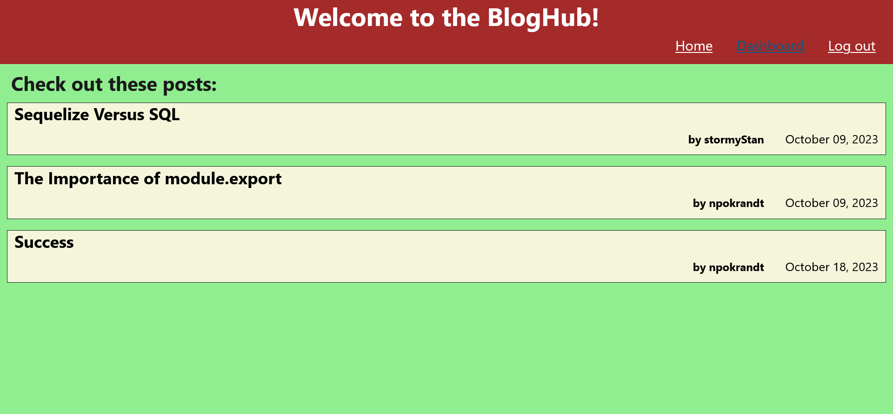

# The Tech Hub

a simple tech blog site

## Description

Welcome to the tech hub, where all the most brilliant tech minds come together to share thoughts! Here they can write their own posts and comment on other people's posts.

## Usage

Upon visiting the website the user is taken to the homepage, where they see all existing blog posts, and options to log in. Before they can write anything, they must create an account. To do so they click on the link to log, and from there they can create an account by adding their username and password. Creating an account logs them in automatically. The website will automatically log them out if they're inactive for too long. To log back in they must go to the login page.

The homepage offers the latest blog posts. It shows cards with the title of each post, date written (or modified) and the username of the author. Users can look at posts whether they are logged in or not, but can only comment on them if they're logged in. The user can return to the home page whenever they want by clicking the link on the header

If a user is logged in they can view their dashboard, which shows the posts they have written, if any. It also has a button for creating new posts. Clicking on that takes them to a page where they can input a title for their post and write the content in a textarea. When they are satisfied, they click the submit button, and are returned to the dashboard with the new post showing up

Blogposts are viewed from the homepage. Each of the cards, when clicked, takes the user to the post, which has the info visible from the homepage and the content as well, plus all comments that have been made on that post. If the user is logged in, they can add a comment of their own. When they click the button they are presented with an area to write their comment. Once they submit it they can see it with the other comments.

Users can also modify or delete their own posts. While visiting one of their pages, they have buttons at the bottom of the post to either edit or delete their post. If they click the edit button they are taken to a page where they can modify the title and/or content and submit those changes. Doing so shows them the dashboard with the modified post. If they push the delete button they will be asked to confirm. Once they do the post and its comments are deleted, and the user is returned to the dashboard.

That's it! Have fun writing blogposts!

## Link

Visit the website here:
https://npokrandt-tech-blog-4bddaac396b9.herokuapp.com/

## Credits

All of this code is my own, plus stuff used from the boot camp and W3schools
